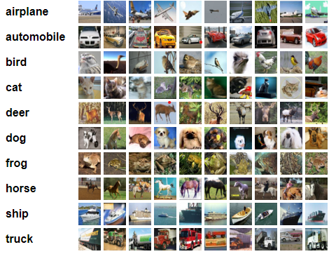

# Классификатор изображений CIFAR-10

Рассматривается задача многоклассовой классификации изображений на 1 из 10 классов. Исходными данными являются цветные изображения 32x32 пикселя, обучающая часть содержит 50000 изображений, тестовая - 10000.



Для демонстрации работы число эпох обучения было уменьшено до минимума, из-за этого сеть не успевает обучиться и полученные предсказания получаются не самыми качественными

## Проверка:
Клонируем репозиторий
```bash
git clone git@github.com:i-alkisev/cifar10_classifier.git
```
```bash
cd cifar10_classifier/
```
Создаем чистое виртуальное окружение с питоном
```bash
conda create --name test-env python=3.11
```
```bash
conda activate test-env
```
Устанавливаем зависимости и запускаем хуки
```bash
poetry install
```
```bash
pre-commit install
```
```bash
pre-commit run -a
```
Запускаем обучение (занимает около 4 минут)
```bash
python train.py
```
Смотрим метрики на трейне и тесте, а также сохраняем предсказание для теста в .csv файл
```bash
python infer.py
```
